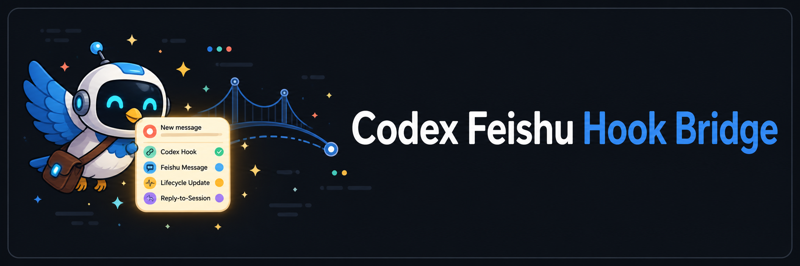
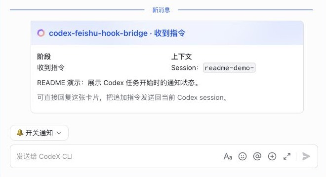
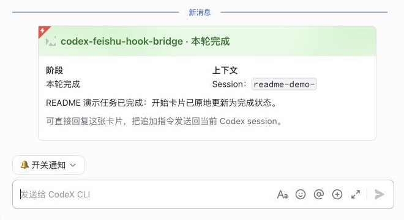

<p align="center">
  
</p>

# Codex Feishu Hook Bridge

<p align="center">
  <a href="README.md">English</a> ·
  <a href="README.zh-CN.md">简体中文</a> ·
  <a href="README.zh-TW.md">繁體中文</a>
</p>

Sync Codex Desktop/CLI task lifecycle updates to Feishu, and let you reply from Feishu to send follow-up instructions back to the original Codex session.

This project is a publishable npm CLI. After one setup and installation flow, the bridge runs locally on the user's Mac without requiring a separate `lark-cli` installation.

## What it does

- Keeps one Feishu Card 2.0 card per Codex turn: `Prompt received` → `Permission required` → `Turn completed`.
- Uses `Project · Stage` as the card title so mobile notifications immediately show the current phase.
- Updates the completion card in place and uses Feishu app urgency for the completion alert instead of creating another card.
- When a user replies to their own prompt message, adds the `Get` reaction; after the prompt is delivered to Codex, replaces it with `DONE` without sending a confirmation message.
- Handles `open_notify` and `close_notify` from the Feishu bot menu rather than repeating notification switches on every status card.
- Routes follow-up instructions to the original `session_id` instead of opening a new Codex session.
- Shares atomic state between hooks and the listener, with idempotency for duplicate Feishu events.

### Status cards in Feishu

The bridge keeps one card for each Codex turn. The same card changes from the blue start state to the green completion state:

<p align='center'>
  
</p>
<p align='center'><em>Blue — <code>UserPromptSubmit</code>: Codex has received the new instruction.</em></p>

<p align='center'>
  
</p>
<p align='center'><em>Green — <code>Stop</code>: the same card has been updated when the turn is complete.</em></p>

### Replying from Feishu

Reply directly to the status card and send a follow-up prompt, for example: <code>Please shorten the installation section in the README.</code> The listener then:

1. checks that the sender is an allowed Feishu user;
2. resolves the replied card to its original <code>session_id</code>;
3. forwards the new prompt to that existing Codex session;
4. adds the <code>Get</code> reaction to the user message when it is received, then replaces it with <code>DONE</code> after the prompt is delivered.

No forwarding confirmation message is created. The reactions are placed on the user's sent message, not on the bridge card.

## One-time installation

Requirements: macOS, Node.js 20 or later, and a working Codex CLI/Desktop installation.

```bash
npx codex-feishu-hook-bridge setup
npx codex-feishu-hook-bridge install
npx codex-feishu-hook-bridge doctor
```

`setup` uses the official Feishu Node SDK app-registration flow. It prints and opens a Feishu authorization page. After confirmation, Feishu creates an app in the user's own tenant and returns the App ID and App Secret. Credentials are written only to `~/.codex/feishu-bridge/config.env` with file mode `0600`.

If the browser cannot be opened automatically:

```bash
npx codex-feishu-hook-bridge setup --no-open
```

For a one-to-one chat, specify the target user:

```bash
npx codex-feishu-hook-bridge setup --target-user-id ou_xxx
```

For a group chat:

```bash
npx codex-feishu-hook-bridge setup --chat-id oc_xxx --allowed-user-ids ou_xxx
```

`install` will:

- Preserve existing entries in `~/.codex/hooks.json` and add bridge hooks for `UserPromptSubmit`, `PermissionRequest`, and `Stop`.
- Write a macOS LaunchAgent so the listener starts after login.
- In the current external `noowners` home layout, generate a disabled source plist and print the command for installing the enabled copy under `/Library/LaunchAgents`.
- Keep the verified `lark-cli` compatibility mode. With no `FEISHU_APP_ID` or `FEISHU_APP_SECRET`, `FEISHU_PROVIDER=auto` falls back to the existing `lark-cli` configuration; after `setup`, the official SDK is used.

## Feishu authorization and permissions

`setup` pre-fills the following app permissions and event subscriptions on the Feishu confirmation page. The final result is determined by the user's confirmation in Feishu.

App permissions:

- `im:message:send_as_bot`: send status cards.
- `im:message:update`: update a status card in place.
- `im:message.p2p_msg:readonly`: receive one-to-one messages.
- `im:message.group_at_msg:readonly`: receive group messages that @ the bot.
- `im:message.reactions:write_only`: add and remove `Get` and `DONE` on the user's prompt.
- `im:message.urgent`: send the completion alert.

Events:

- `im.message.receive_v1`: receive follow-up instructions from Feishu.
- `application.bot.menu_v6`: receive `open_notify` and `close_notify` menu events.

Official Feishu documentation:

- [Application scopes and message permissions](https://open.feishu.cn/document/server-docs/application-scope/scope-list)
- [Receive message events](https://open.feishu.cn/document/server-docs/im-v1/message/events/receive?lang=zh-CN)
- [Create messages](https://open.feishu.cn/document/uAjLw4CM/ukTMukTMukTM/reference/im-v1/message/create)
- [Self-built apps and store apps](https://open.feishu.cn/document/home/app-types-introduction/self-built-apps-and-store-apps)

## Configuration

See [`config.example.env`](./config.example.env). Common settings:

```dotenv
FEISHU_PROVIDER=auto
FEISHU_APP_ID=cli_xxx
FEISHU_APP_SECRET=stored locally only
FEISHU_TARGET_USER_ID=ou_xxx
FEISHU_ALLOWED_USER_IDS=ou_xxx
FEISHU_STOP_URGENT=true
CODEX_APP_SERVER_MODE=ipc
```

Never commit `config.env`, the App Secret, state files, or logs. `.gitignore` covers these local files.

## Development

```bash
npm install
npm run check
npm run pack:check
```

`npm run check` is a local installation diagnostic that checks Feishu targets and Codex configuration; GitHub Actions intentionally does not run it. The CI workflow is manual: open `Actions` → `CI` → `Run workflow`. It does not run automatically on pushes or pull requests.

Key entry points:

- `src/cli.mjs`: npm command-line entry point.
- `src/setup.mjs`: Feishu app authorization/creation and local credential storage.
- `src/sdk.mjs`: official SDK API and WebSocket event adapter.
- `src/hook.mjs`: maps Codex hook lifecycle events to Card 2.0 states.
- `src/listener.mjs`: handles Feishu messages, reactions, and bot menu events.
- `src/install.mjs`: installs `hooks.json` entries and the macOS LaunchAgent.

## Publishing to GitHub and npm

Repository: [szguicheng/codex-feishu](https://github.com/szguicheng/codex-feishu)

The package is currently published as `codex-feishu-hook-bridge@0.1.1`:

```bash
npm install codex-feishu-hook-bridge
```

The npm release workflow runs only for `v*` tags. Ordinary pushes to `main` do not publish a new npm version. To release a later version:

```bash
npm version patch
git push --follow-tags
```

The repository also contains a manual CI workflow and a GitHub Pages workflow for the onboarding page. Do not commit npm tokens or Feishu credentials. For long-term release automation, npm Trusted Publishing with GitHub Actions OIDC is preferable to a long-lived publish token; see the [npm Trusted Publishing documentation](https://docs.npmjs.com/trusted-publishers/).

## Product boundary

The current design is local-first: each user creates an app in their own tenant and stores their own credentials locally. We do not centrally store tenant tokens or maintain a cloud long connection for every user.

A future SaaS or Feishu App Store product would need a separate ISV/store-app mode. In that model, the maintainer would operate a multi-tenant app, users would authorize installation, the cloud would store tenant bindings and route events, and the local CLI would keep only a short-lived device pairing credential. This involves Feishu App Store review, administrator installation, and cloud key management, so it should not be mixed into the current local self-built-app flow.

## Current limitations

- `ipc` mode depends on the current Codex Desktop local IPC protocol; after a Codex upgrade, revalidate `thread-follower-start-turn`.
- The installer currently targets macOS. Linux systemd and Windows Task Scheduler support can be added later.
- Feishu app permissions, bot availability, and production release remain subject to tenant administrator policy. `setup` can create and pre-fill the app configuration, but the user must confirm the final authorization.

## License

MIT
